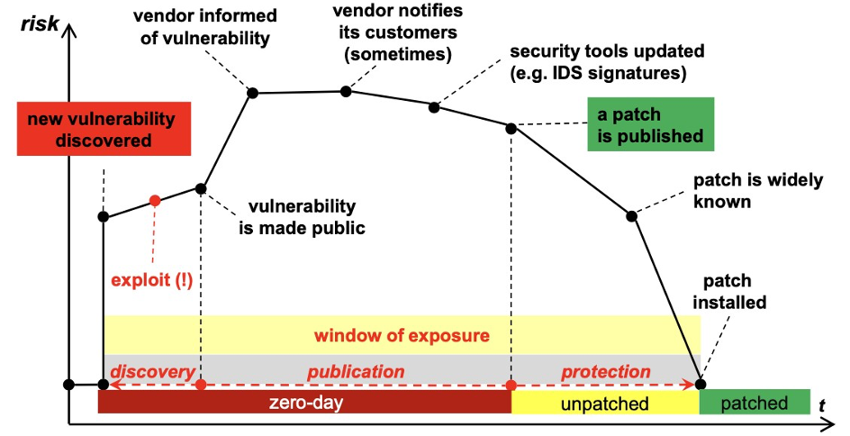

# Notes
- **Security defenition**
	- security is more an issue of keeping the data secret, preserving data, protecting its integrity
	- computer security protects mainly the information/data:
		- **stored** (memory, disk)
		- **at work** (in RAM, used by a process)
		- **in transit** over the networks
- **CIA model**
	- **Confidentiality:** protecting information from unauthorized access
	- **Integrity:** data are trustworthy, complete, and have not been altered or modified by an unauthorized user
	- **Availability:** data are accessible when you need them
- **Some terminology**
	- **incident:** a security event that compromises the integrity, confidentiality, or availability of an information asset
	- **(data) breach:** an incident that results in the disclosure or potential exposure
	- **(data) disclosure:** a breach for which it was confirmed that data was actually disclosed (not just exposed) to an unauthorized party
	- **assets:** the set of resources (hardware, software), data, people, and location needed for an IT service
	- **vulnerabilities:** intrinsic weakness in a system, system security procedure, internal controls, or implementation that could be exploited by a threat source
	- **threat:** possible deliberate action / accidental event that can produce the loss of a security property by exploiting a vulnerability
	- **attack:** threat occurrence by deliberate action
	- **negative event:** threat occurrence by accidental event
	- **RISK = IMPACT * PROBABILITY**
- **Basic security attacks**
	- **packet sniffing:**
	- **ip spoofing:**
	- **denial of service:**
	- **distributed denial of service:**
	  id:: 67e425d3-fa11-4d38-89b1-a81f59772c81
	- **shadow server:**
	- **man in the middle:**
	- **arp poisoning:**
- **Malware terminology**
	- **virus:** A program which embeds into a host program, does damage and then replicate itself, propagated involuntarily by humans installing application, or by system manager who configure system in a wrong way. Some countermeasures are user awareness or antivirus
	- **worm:** A program which does damage then replicate itself automatically (saturating the resources)
	- **trojan:** A type of malware disguised as a legitimate software, designed to
	  perform malicious actions secretly
	- **backdoor:** A way to access a device bypassing normal entry point and access control, so it’s an unauthorized access point. Maybe you install a software and it activate a network service
	- **rootkit**: privileged access tools, hidden in modified program, driver or kernel, which are stealth. Used for surveillance or data theft, usually replace system code without impacting the core OS functions, altering log files
	- **keylogger:** record and send user keystrokes to an attacker
	- **PUA:** not directly dangerous but unwanted
	- **ransomware:** attackers take control of a target’s assets and demand a ransom
	- **RaaS:** organized ransomware group, business model
	-
- **Window of exposure**
	- **zero-day:**
		- it refers to a software security vulnerability that is unknown to the software vendor and has zero days of protection or patch available when it is first discovered and exploited by malicious actors
	- 
- **Security principles**
	- **simplicity:**
		- keep the design as simple and small as possible, eliminating unnecessary complexity.
		- The first axiom of engineering says “ the more complex a system is, the more difficult will be to check its correctness “. AKA KISS rule (keep it simple, stupid)
		- perhaps the most difficult principle to honor due to constant demand for new features
		- reduce the number of components used, retain only those that are essential
	- **know your threat model:**
	- **open–design:**
		- do not rely on secret designs, attacker ignorance, or security by obscurity
		- it should not require secrecy, and it should not be a problem if it falls into enemy hands
		- we must assume that the attacker (ultimately) knows your system (algorithms, hardware, defenses, etc) and invite and encourage open review and analysis
	- **cost:**
		-
	- **defense in depth:**
		- multiple types of defenses should be layered together
		- an attacker should have to breach all defenses to successfully attack a system
		- defenses are often less than the sum of their parts
	- **least privilege:**
		- consider what permissions an entity or a program needs to be able to perform its job correctly
		- grant only those permissions and for the shortest duration necessary
	- **separation of privilege:**
		-
- **Stuxnet**
-
- # Questions