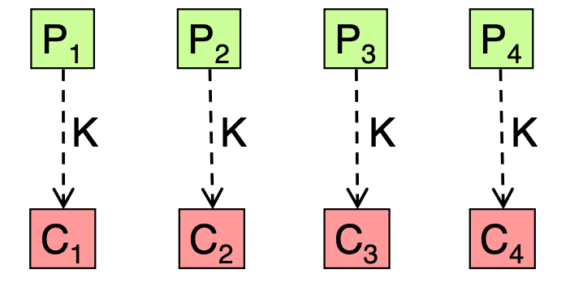
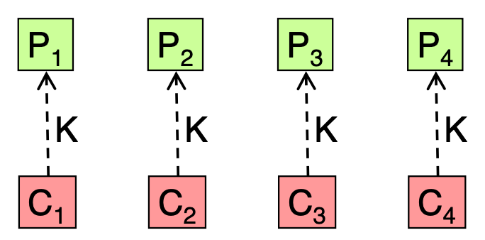
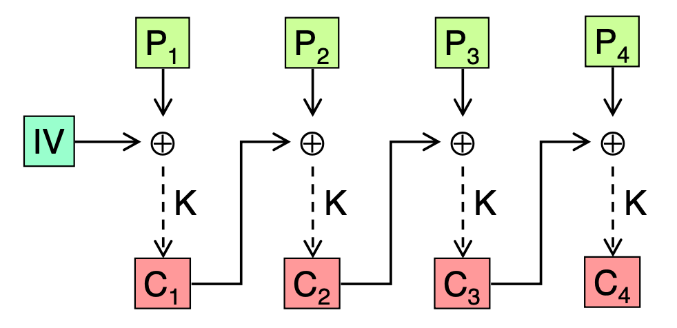
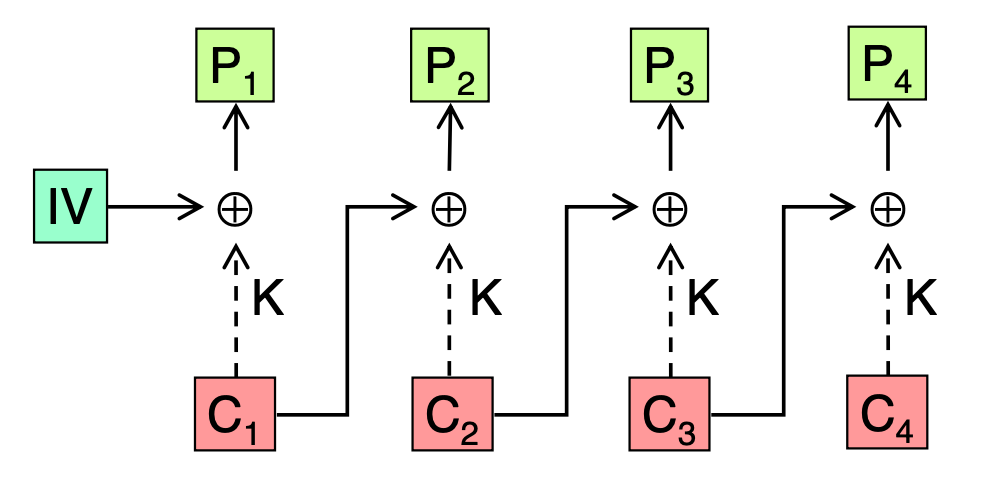
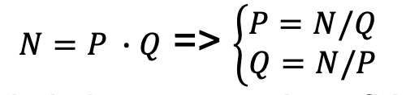
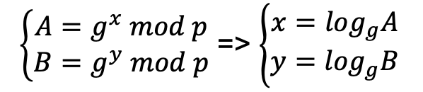

# Notes
- **Terminology:**
	- a message in clear text will be referred to as **P**
	- an encrypted message will be referred to as **C**
- **Symmetric**
	- AKA secret key cryptography
	- Kerchoffs’ principle
		- if the keys are kept secret, managed by trusted systems, and are of adequate length, then the encryption and decryption algorithms do not need to be kept secret. In fact, it is better to make them public for analysis and identification of potential weaknesses.
	- **block algorithms**
	  collapsed:: true
		- divide the data in blocks of fixed length, each block is processed one at a time
		- **DES**
			- 56 bits key (+8 parity bits) = 64 bits
			- 64 bits data block
		- ~~**2DES**~~
			- is subject to a known-plaintext attack named meet-in-the-middle which
			  allows to decrypt data with at most 2N+1 attempts (if the keys are N-bit long)
		- **3DES**
			- repeated application of DES
			- with 2 keys
				- Keq=112 bit
				- **C’ = enc (K1 , P)  C’’ = dec (K2 , C’)  C = enc (K1 , C’’)**
			- with 3 keys
				- Keq=168 bit
				- **C’ = enc (K1 , P)  C’’ = dec (K2 , C’)  C = enc (K3 , C’’)**
		- **AES(RIJNDAEL)**
			- key lengths can vary **128 / 192 / 256 bit**
			- block size is of **128 bits**
	- **application of block algorithms**
		- encrypt data **>** block size
			- **ECB**
			  collapsed:: true
				- encryption of the i-th block: Ci = enc ( K, Pi )
					- {:height 113, :width 246}
				- decryption of the i-th block: Pi = enc-1 ( K, Ci )
					- {:height 165, :width 256}
				- pros
					- blocks can be encrypted in parallel
					- no error propagation: an error in transmission generates an error at the decryption of one block
				- cons
					- swapping of two ciphertext blocks (e.g. Ci and Ci+1) goes undetected
					- identical (plaintext) blocks generate identical ciphertexts hence it is vulnerable to known-plaintext attacks
			- **CBC**
			  collapsed:: true
				- encryption of the i-th block: Ci = enc (K, Pi ⊕ Ci-1)
					- requires C0 = IV (Initialization Vector)
					- {:height 145, :width 282}
				- decryption of the i-th block: Pi = enc-1 ( K , Ci ) ⊕ Ci-1
					- requires C0 (i.e. IV) to be known by the receiver
					- {:height 195, :width 297}
				- pros
					- no swapping attacks: by exchanging two blocks Ci and Ci+1, the obtained decrypted blocks Pi, Pi+1 and Pi+2 will be corrupted
					- no known-plaintext attacks: identical (plaintext) blocks will not result anymore in identical cyphertexts
				- cons
					- error propagation: one error in transmission (e.g. in Ci) generates an error at the decryption of two blocks (i.e. in Pi and Pi+1)
					- blocks not encrypted in parallel but sequentially (we must wait for Ci in order to be able to encrypt Pi+1)
		- encrypt data **<** block size
			- **Padding**
			  collapsed:: true
				- a common issue with block algorithms is that the size of data to be processed (D) usually is not a multiple of the algorithm’s block size (B), so we need to add bits until a multiple of B is reached
				- problems
					- transmit more data (B) than needed (D)
					- what should be the value of padding bits
				- techniques
					- add null bytes
					- one 1 bit followed by many 0
					- one byte with value 128 followed by null bytes
					  id:: 67ed42bb-4b56-46cc-90d0-f5f7f587bd4f
			- **CTS**
				- allows to use block algorithms without padding
			- **CTR**
				-
	- **stream algorithms**
		- operate on flows of data, one bit or one byte at a time
- **Asymmetric**
	- AKA public key cryptography
	- **public key algorithms**
		- **RSA**
			- {:height 71, :width 192}
		- **DSA**
			- {:height 68, :width 202}
	- **key agreement algorithms**
		- **DH**
			- **A** and **B** agree on two public integers **p** (prime, large) and **g** (generator):
				- **1 < g < p .** (length of DH key = no. of bits of p bits)
			- **A** arbitrarily choose a private exponent **X>0** and computes:
				- **A_pub = g^x mod p.**
			- **B** arbitrarily choose a private exponent **Y> 0** and computes:
				- **B_pub = g^y mod p**.
			- **A** and **B** exchange A and B in clear
			- they now compute separately the same key:
				- A computes **KA = Y^x mod p**
				- B computes **KB = X^y mod p**
				- **KA = KB = g^xy mod p**
	- **message integrity**
		- digest
		- the birthday pardox
		- the birthday attack
		- key derivation function
		- keyed digest
- **Authenticated encryption**
- **Digital signature**
- **Public key infrastructure**
- # Questions