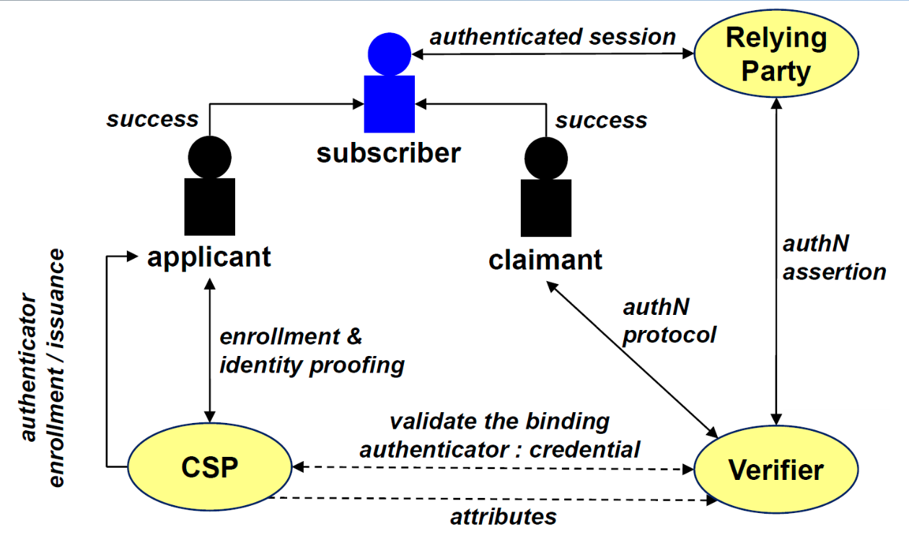

# Notes
- **Digital authentication model**
	- {:height 221, :width 409}
- **Generic authentication protocol**
- **Password-based authentication**
-
- **Challenge Response Authentication**
	- symmetric
	- asymmetric
- **OTP**
	- password valid only for one run of the authentication protocol
	-
	- time-based OTP
	- event-based OTP
	- out-of-band OTP
- **2FA/MFA**
- **Biometric systems**
- **FIDO**
	- registration
	- login
	- authentication
- # Questions