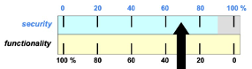

# Notes
- **Firewall design**
	- you don’t "buy" a firewall, you design it!
	- we need to achieve an optimal trade-off between security and functionality with minimum cost
		- the security index:
			- 
	- the 3 commandments of firewall
		- the FW must be the only contact point of the internal network with the external one
		- only the “authorized” traffic can traverse the FW
			- basically authorized means traffic allowed in the policies of the FW
		- the FW must be a highly secure system itself
			- this means that an attacker should not be able to deactivate the firewall itself
	- **authorization policies**
		- **default-deny**
			- Default-deny: by default, every network service is denied, unless is has been specifically listed as allowed (allowlist)
		- **default-allow**
			- by default, every network service is allowed, unless is has been specifically listed as denied (denylist)
- **Firewall types**
	- **packet filter (network level):**
		- it is a very simple one but the fastest, which can only check the IP header, so source and destination addresses, and some data from the transport or datalink level
	- **circuit gateway (TCP level):**
		- this fragment can investigate the payload and inspect the segments, but only that
	- **application gateway (application level):**
		- it is the most accurate one, because it controls also the application data, and take decision. It is also more secure but it needs more time to do this operations
- **HTTP Proxy**
	- **forward proxy**
	- **reverse proxy**
- **Intrusion detection system**
	- **active IDS**
		- identify an attack while it is being performed
	- **passive IDS**
		- waiting for an attack to be performed and then identify the attack based on some measurement
-
- # Questions