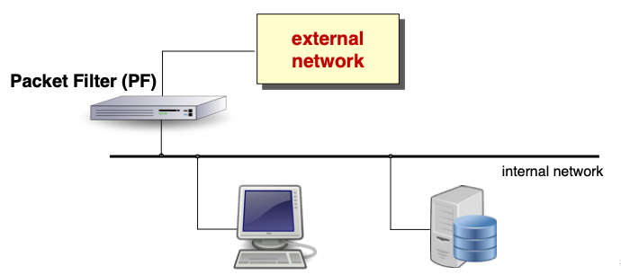

# Notes
- **Firewall design**
	- you don’t "buy" a firewall, you design it!
	- we need to achieve an optimal trade-off between security and functionality with minimum cost
		- the security index:
			- 
	- the 3 commandments of firewall
		- the FW must be the only contact point of the internal network with the external one
		- only the “authorized” traffic can traverse the FW
			- basically authorized means traffic allowed in the policies of the FW
		- the FW must be a highly secure system itself
			- this means that an attacker should not be able to deactivate the firewall itself
	- **authorization policies**
		- **default-deny**
			- by default, every network service is denied, unless is has been specifically listed as allowed (allowlist)
		- **default-allow**
			- by default, every network service is allowed, unless is has been specifically listed as denied (denylist)
- **Firewall types**
	- **packet filter (network level):**
		- it is a very simple one but the fastest, which can only check the IP header, so source and destination addresses, and some data from the transport or datalink level
	- **circuit gateway (TCP level):**
		- this fragment can investigate the payload and inspect the segments, but only that
	- **application gateway (application level):**
		- it is the most accurate one, because it controls also the application data, and take decision. It is also more secure but it needs more time to do this operations
- **Firewall architectures**
	- **screening router:**
		- it is a network device that filters traffic between an internal network and an external network using packet filtering rules. It inspects packets based on IP addresses, ports, and protocols, allowing or blocking traffic according to predefined security policies
		- while simple and efficient, it lacks deep inspection capabilities and is often used as the first layer of defense in combination with other security mechanisms
		- due to security bugs or improper configuration of the screening router, it is a single point of failure
		- {:height 267, :width 489}
	- **dual-homed gateway:**
		- {:height 265, :width 503}
	- **screened host:**
		- {:height 265, :width 515}
	- **screened subnet:**
		- aka DMZ(Demilitarized Zone)
		- it is a more secure architecture that uses two firewalls to create an isolated network
		  segment between the external and internal networks
		- the outer firewall filters internet traffic, while the inner firewall protects internal systems.
		- the DMZ hosts public-facing services, such as web or email servers, ensuring that if they are compromised, attackers do not gain direct access to the internal network
		- This architecture is the most expensive one because you need three
		  different devices. To reduce costs and simplify management some vendors created a Gateway that merge the functionality of the three devices, it is called the **three-legged firewall**.
		- {:height 297, :width 512}
	- **bastion host:**
		- it is a highly secured and hardened server designed to withstand attacks, as it is exposed to the internet. It is often placed in a DMZ and used for critical functions such as proxy services, VPN gateways, or remote access control
		- since it is a primary target for attacks, it runs only essential services, is regularly updated, and has strict access controls to minimize vulnerabilities
	- **honeypot:**
		- it is a decoy system or server designed to attract and monitor cyber attackers by simulating vulnerable systems. It collects data on attack techniques, helping organizations improve security defenses
		- they can be deployed in a DMZ or isolated network to prevent attackers from reaching real
		  systems
		- while valuable for threat intelligence, improper deployment can pose a security risk if compromised
- **HTTP Proxy**
	- It is an intermediary server that processes HTTP requests and responses between a client and a destination server. It can be used for caching, security, logging, filtering, and anonymity
	- **forward proxy**
		- it acts as an intermediary between clients and the internet. When a client sends a request, the proxy forwards it to the destination server and returns the response to the client
		- advantages:
			- Shared Cache: Stores external pages to reduce bandwidth usage for internal users.
			- Authentication & Authorization: Controls access based on user identity.
			- Traffic Controls: Regulates allowed websites, data types, and transfer directions.
	- **reverse proxy**
		- it sits in front of web servers, handling incoming client requests and forwarding them to the appropriate backend server
		- advantages:
			- Obfuscation: Hides backend server details from clients for security.
			- TLS Accelerator: Offloads SSL/TLS encryption to reduce backend load.
			- Load Balancer: Distributes traffic across multiple servers for better performance.
			- Web Accelerator: Caches static content to improve speed and reduce load.
			- Spoon Feeding: Slowly delivers content to clients with low bandwidth to prevent timeouts.
- **Intrusion detection system**
	- types:
		- **active IDS**
			- identify an attack while it is being performed
		- **passive IDS**
			- waiting for an attack to be performed and then identify the attack based on some measurement
	- topological features
		- **NIDS**
			- monitors network traffic for suspicious activities
			- components:
				- sensor
				- director
				- IDS message system
		- **HIDS**
			- runs on individual devices, monitoring logs and system activities using:
				- SIV (system integrity verifier):
					- checks files / filesystems looking for changes to Windows registry, cron configuration, user privileges
					- it uses cryptographic hashes (e.g. Tripwire) to detect modifications
				- LFM (log file monitor):
					- checks the log files (OS and applications)
					- looks for known patterns of successful attacks or attempts
					- swatch is an example of a real-time log monitoring tool
-
- # Questions